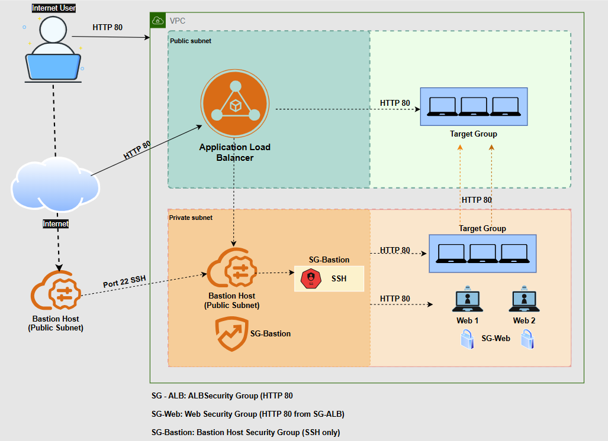

# Secure Web Application Deployment on AWS using Ansible & ALB

Secure access via Bastion (no public IPs on web servers)

Automated NGINX + HTML deploy via Ansible

High availability via ALB across 2 public subnets (2 AZs)

## Overview
This project demonstrates a secure, highly available web application deployment on AWS using:
- EC2 (Bastion + 2 private web servers)
- Application Load Balancer (ALB)
- VPC with public/private subnets
- Security Groups (least privilege)
- Ansible automation (NGINX + HTML deployment)

## Architecture


## Security Design
- Web servers have **no public IP**
- SSH access is only through the **Bastion Host**
- Web servers allow **HTTP (80) only from the ALB security group**
- Bastion allows **SSH (22) only from my IP**

## Automation (Ansible)
Playbooks are in `ansible/`.

Run (example):
```bash
ansible -i ansible/inventory.ini webservers -m ping
ansible-playbook -i ansible/inventory.ini ansible/site.yml
